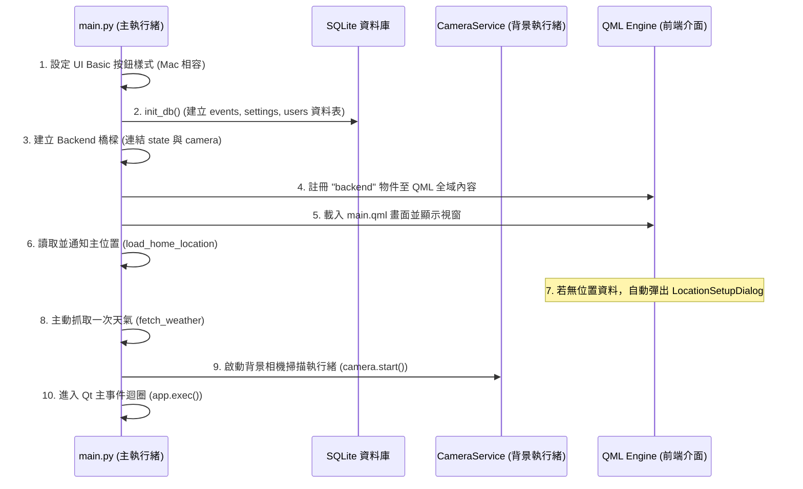
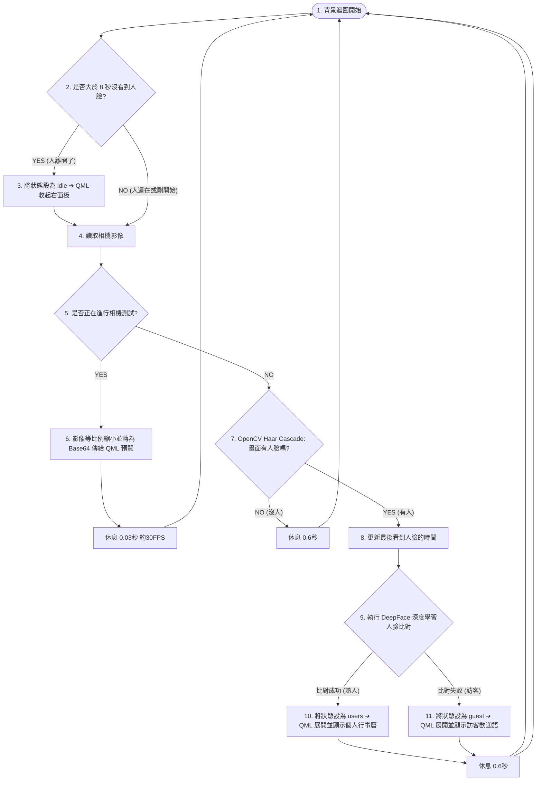
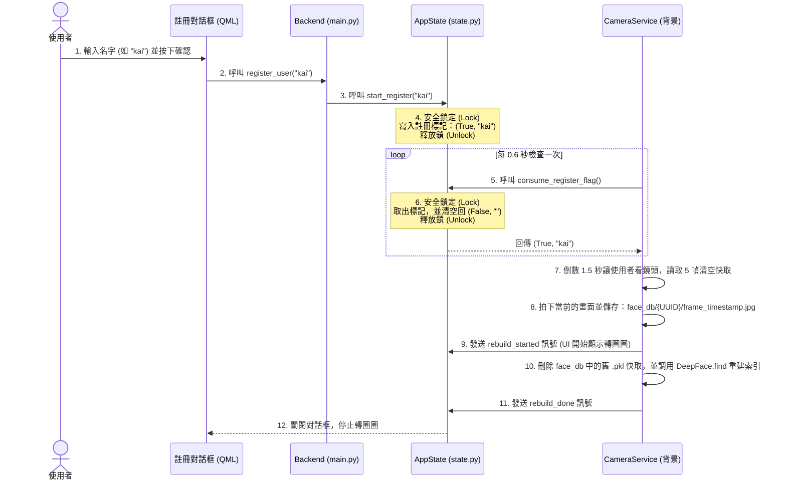
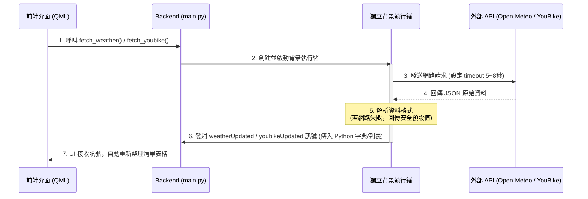
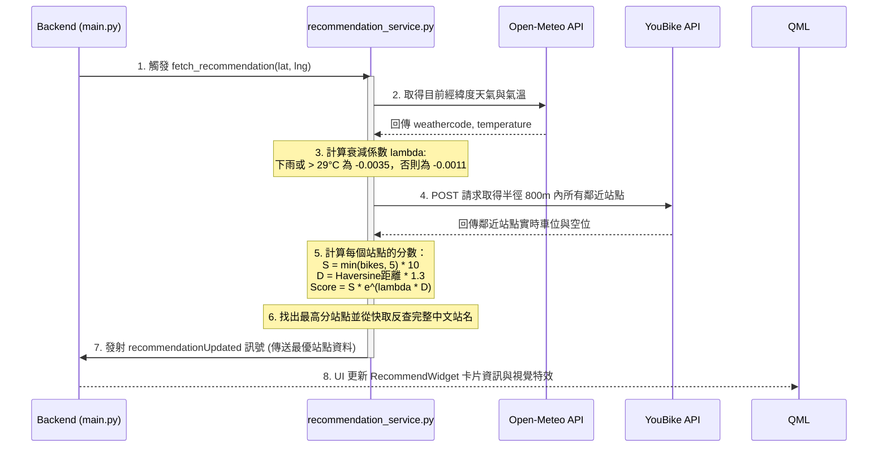

# 🏠 玄關智慧中樞 (Entryway Smart Hub)

「玄關智慧中樞」是一款專為家居入口（玄關）設計的智慧終端系統。透過背景相機的 OpenCV 與 DeepFace 人臉辨識技術，系統能在偵測到特定家庭成員時自動展開個人化面板，顯示該成員的行事曆（具隱私過濾），並結合即時天氣資訊與基於環境因子計算的最佳 YouBike 租借推薦，打造流暢且極具科技感的出門體驗。

---
## Demo

https://github.com/user-attachments/assets/dcfd0f3d-ed79-4b0b-84b0-e214c4fb5d26

---

## 🚀 安裝與執行指南

### 1. 系統需求
* **作業系統**：macOS (已完美相容與測試) 或 Windows / Linux。
* **Python 版本**：`>= 3.11`。
* **硬體設備**：需連接 USB 攝影機，或具備內建鏡頭（macOS 支援 Continuity Camera 接續互通相機）。

### 2. 安裝步驟

專案推薦使用 Rust 編寫的快速 Python 套件管理器 [**uv**](https://github.com/astral-sh/uv) 進行環境管理。

#### 使用 `uv` (推薦)
1. **同步虛擬環境並安裝依賴**：
   ```bash
   uv sync
   ```
2. **執行應用程式**：
   ```bash
   uv run main.py
   ```

#### 使用傳統 `pip` 與虛擬環境
1. **建立並啟動虛擬環境**：
   ```bash
   python -m venv .venv
   source .venv/bin/activate  # macOS / Linux
   # .venv\Scripts\activate  # Windows
   ```
2. **安裝依賴套件**：
   ```bash
   pip install -r pyproject.toml
   # 或者手動安裝：
   pip install PyQt6 opencv-python deepface requests aiohttp numpy tf-keras
   ```
3. **執行應用程式**：
   ```bash
   python main.py
   ```

### 3. 首次啟動與使用注意事項

> [!IMPORTANT]
> **1. macOS 權限取得**
> 在 macOS 系統上執行時，終端機或 IDE 必須取得**「相機存取權限」**。若執行時相機畫面為黑畫面或程式閃退，請前往 `系統設定` -> `隱私權與安全性` -> `相機`，確認開啟您的終端機/編輯器權限。

> [!NOTE]
> **2. AI 模型初次下載**
> 系統首次執行且人臉辨識啟動時，若檢測到本地無 DeepFace 權重檔，會自動在背景從網上下載 `ArcFace` 重點權重檔（約 130MB）與 `RetinaFace` 偵測權重。
> 此時 UI 會彈出**「正在下載 AI 模型...」**的提示視窗，請保持網路連線通暢。下載完成後此對話框會自動關閉，此過程僅在首次啟動時發生。

> [!TIP]
> **3. 初始主位置設定**
> 程式啟動後若檢測到無主位置設定，會主動跳出引導視窗。請輸入您所在的區域（例如 `台北市信義區` 或 `Taipei`），搜尋並確認座標後，系統會自動在背景將該處設為您的「家」，並自動添加附近的天氣資訊與最靠近您的 6 個 YouBike 站點至您的主面板中。

---

## 🌟 系統核心功能特點

### 1. 👤 AI 智慧人臉辨識與個人化體驗 (Face ID & Auto-Layout)
* **快速影像過濾**：背景執行緒持續以 0.6 秒間隔，使用 OpenCV Haar 級聯分類器快速檢索畫面上是否有人臉，節省 CPU 開銷。
* **精準深度學習比對**：一旦有人臉出現，即調用 DeepFace 的 **RetinaFace**（偵測器）與 **ArcFace**（特徵比對模型），對比註冊資料夾 `face_db`。
* **防偽與狀態轉換**：
  * **已辨識熟人 (`users`)**：QML 右側面板自動展開，顯示個人化歡迎語及專屬行事曆。
  * **訪客 (`guest`)**：展開面板並顯示訪客歡迎語。
  * **閒置 (`idle`)**：當持續 8 秒（`_NO_FACE_TIMEOUT`）未偵測到任何人臉時，右側面板會自動收闔。
* **無縫註冊機制**：支援直接在 UI 輸入名字並透過相機拍照註冊，後台自動重建特徵庫。

### 2. 🚲 YouBike 站點監控與「智慧最佳推薦」 (Smart YouBike Recommendation)
* **即時站點資訊**：非同步抓取台北市 YouBike 2.0 即時 API，區分一般車（YouBike 2.0）與電輔車（YouBike 2.0e）的數量，並顯示可停空位。
* **智慧推薦演算法**：根據目前的位置座標與實時天氣，使用科學公式計算出附近最划算的租車點。
  $$\text{Score} = S \times e^{\lambda \times D}$$
  * $D$ 為使用者與站點的步行距離（Haversine 直線距離乘以 $1.3$ 曼哈頓係數）。
  * $S$ 為車輛充足度評分： $`\min(\text{available\_spaces}, 5) \times 10`$ （最多 50 分，避免單一站點車輛過多導致誤判，優先考慮距離）。
  * $\lambda$ 為天氣衰減係數：涼爽舒適時為 $-0.0011$；當下雨（WMO 代碼 $\ge 51$）或酷暑（氣溫 $> 29^\circ\text{C}$）時，衰減係數提高至 $-0.0035$（大幅扣減步行距離遠的站點分數）。
  * 系統會將得分最高的站點以炫彩卡片置頂推薦，並標註「最佳推薦」與「天氣折扣」標記。

### 3. ☀️ 即時天氣與 WMO 狀態視覺化
* **多城市追蹤**：串接 Open-Meteo 免費氣象 API，非同步獲取設定城市的溫度、體感溫度、濕度與風速。
* **WMO 代碼轉換**：精確將 WMO 天氣代碼轉換為對應的 Material 圖標、中文描述與特定色調（如雷雨為紫色、晴天為暖橘色）。

### 4. 📅 行事曆管理與隱私過濾控制 (Calendar Privacy Filter)
* **非同步讀寫**：行事曆列表不卡住 UI 執行緒，確保流暢度。
* **三層隱私層級**：
  1. **公開 (`public`)**：任何人站在玄關（訪客或熟人）皆可檢視。
  2. **私有 (`private`) / 分享 (`shared`)**：必須當前辨識出的家庭成員（`owner_id`）包含該熟人時，該事件才會解鎖顯示於列表中。

### 5. ⚙️ 系統設定與初次啟動導引 (Setup Wizard)
* **主位置引導**：首次啟動若檢測到資料庫無設定位置，自動彈出 Location Setup 對話框，利用 OSM Nominatim API 搜尋座標，並自動根據該座標導入當地的天氣與附近 YouBike 站點。
* **設定面板**：支援搜尋新增天氣追蹤城市、搜尋新增 YouBike 監控站點、切換相機來源（支援即時畫面測試預覽）。

---

## 🗂️ 專案架構與檔案結構說明

```
Glance/ (專案根目錄)
├── main.py                          # 程式啟動進入點（連接 Python 後端與 QML 前端）
├── README.md                        # 系統架構與流程圖手冊
├── requirements.txt                 # pip 相依套件清單
├── pyproject.toml / uv.lock         # Python 專案套件依賴與鎖定檔 (使用 uv 管理)
├── entryway.db                      # SQLite 資料庫（儲存行事曆、使用者資料與系統設定）
├── youbike_stations_cache.json      # YouBike 全局站點反查快取檔 (啟動時自動下載/更新)
├── face_db/                         # 註冊的人臉相片資料夾（依 UUID 分類儲存，內含 DeepFace 快取）
│
├── services/                        # 後端服務模組 (Backend Services)
│   ├── __init__.py                  #     └─ 初始化定義
│   ├── state.py                     #     └─ AppState：全域狀態與執行緒同步鎖管理
│   ├── camera_service.py            #     └─ 背景 OpenCV 擷取與 DeepFace 人臉辨識執行緒
│   ├── database.py                  #     └─ SQLite 資料庫讀寫（行事曆事件與 Visibility 過濾）
│   ├── weather_service.py           #     └─ 非同步抓取 Open-Meteo 天氣 API
│   ├── youbike_service.py           #     └─ 非同步抓取台北市 YouBike 即時車位 API
│   ├── settings_service.py          #     └─ 設定管理、OSM 城市/地點搜尋與鄰近 YouBike 檢索
│   └── recommendation_service.py    #     └─ 智慧 YouBike 推薦演算法（綜合距離、車量、氣溫與降雨）
│
└── qml/                             # 前端使用者介面 (Frontend QML)
    ├── main.qml                     #     └─ 主視窗與面板展開/縮放動畫控制器、毛玻璃背景模糊效果
    ├── LeftPanel.qml                #     └─ 左側常駐面板（時間與滾動的天氣、YouBike、推薦卡片）
    ├── RightPanel.qml               #     └─ 右側彈出面板（個人化行事曆與註冊按鈕）
    ├── ClockWidget.qml              #     └─ 時間/日期顯示小工具
    ├── WeatherWidget.qml            #     └─ 天氣清單小工具
    ├── YouBikeWidget.qml            #     └─ 監控的 YouBike 站點狀態小工具
    ├── RecommendWidget.qml          #     └─ 智慧推薦 YouBike 站點卡片（置頂漸層特效）
    ├── CalendarWidget.qml           #     └─ 行事曆清單與刪除/檢視小工具
    ├── SettingsDialog.qml           #     └─ 系統設定彈出視窗（設定相機、位置、天氣與站點）
    ├── LocationSetupDialog.qml      #     └─ 初次啟動位置設定引導視窗
    ├── RegisterDialog.qml           #     └─ 人員註冊拍照與倒數彈出視窗
    ├── AddEventDialog.qml           #     └─ 新增行事曆事件對話框
    ├── RefreshButton.qml            #     └─ 通用旋轉刷新按鈕組件
    ├── calendar_utils.js            #     └─ 行事曆時間格式化 JS 輔助模組
    └── fonts/                       #     └─ Material Icons 字型檔檔（圖標來源）
```

---

## ⚙️ 技術架構與五大核心流程

### 1. 系統啟動與初始化流程 (System Startup)
當啟動 `main.py` 時，系統會依序完成資料庫與服務的初始化，並在 UI 載入後彈出位置設定或啟動相機。



---

### 2. 人臉偵測、辨識與介面更新流程 (Face Detection & UI Update)
背景相機服務不斷循環讀取影像，當發現有人臉時會調用 DeepFace 進行比對並觸發 UI 展開。當人離開時自動關閉。



---

### 3. 新人員註冊流程 (User Registration)
註冊新人員時，為防止執行緒衝突，利用 `AppState` 的 `threading.Lock` 安全傳遞註冊訊號，背景相機線程讀取後執行拍攝與特徵庫重建。



---

### 4. 資料非同步抓取流程 (Async Weather & YouBike Fetch)
為避免網路請求阻塞 Qt 的主 UI 執行緒，所有的網路/搜尋請求皆於 Python 獨立背景執行緒中運行，完成後再發射訊號回傳給 QML。



---

### 5. YouBike 智慧推薦分數運算流程 (Smart Recommendation Algorithm Flow)
當狀態切換為非閒置模式（`users` 或 `guest`）時，系統會自動在背景啟動推薦服務計算，並將最高分站點顯示在 UI 置頂卡片。



---

## 🗄️ 資料庫設計 (Database Schema)

資料庫使用本地 SQLite 檔案 `entryway.db`，包含以下三個資料表：

### 1. `users` (使用者名單)
儲存已註冊的人臉 UUID 與其顯示名稱對照表。
| 欄位名稱 | 型態 | 屬性 | 說明 |
| :--- | :--- | :--- | :--- |
| **uuid** | TEXT | PRIMARY KEY | 使用者的唯一識別碼 (對應 `face_db/{uuid}/` 資料夾) |
| **name** | TEXT | NOT NULL UNIQUE | 使用者設定的顯示姓名 |

### 2. `events` (行事曆事件)
儲存所有行事曆項目。
| 欄位名稱 | 型態 | 屬性 | 說明 |
| :--- | :--- | :--- | :--- |
| **id** | INTEGER | PRIMARY KEY AUTOINCREMENT | 事件唯一識別碼 |
| **title** | TEXT | NOT NULL | 事件標題 |
| **start_dt** | TEXT | NOT NULL | 開始時間 (格式: `YYYY-MM-DD HH:MM`) |
| **end_dt** | TEXT | NOT NULL | 結束時間 (格式: `YYYY-MM-DD HH:MM`) |
| **visibility** | TEXT | NOT NULL DEFAULT 'public' | 隱私層級 (`public`, `private`, `shared`) |
| **owner_id** | TEXT | - | 擁有者姓名。多個擁有者以逗號隔開 (如 `kai,amy`) |

### 3. `settings` (系統設定)
以 JSON 格式儲存全域系統配置。
| 欄位名稱 | 型態 | 屬性 | 說明 |
| :--- | :--- | :--- | :--- |
| **key** | TEXT | PRIMARY KEY | 設定鍵名 (例如 `home_location`, `weather_locations`, `youbike_stations`, `camera_index`) |
| **value** | TEXT | NOT NULL DEFAULT '{}' | JSON 格式的設定值內容 |

---
