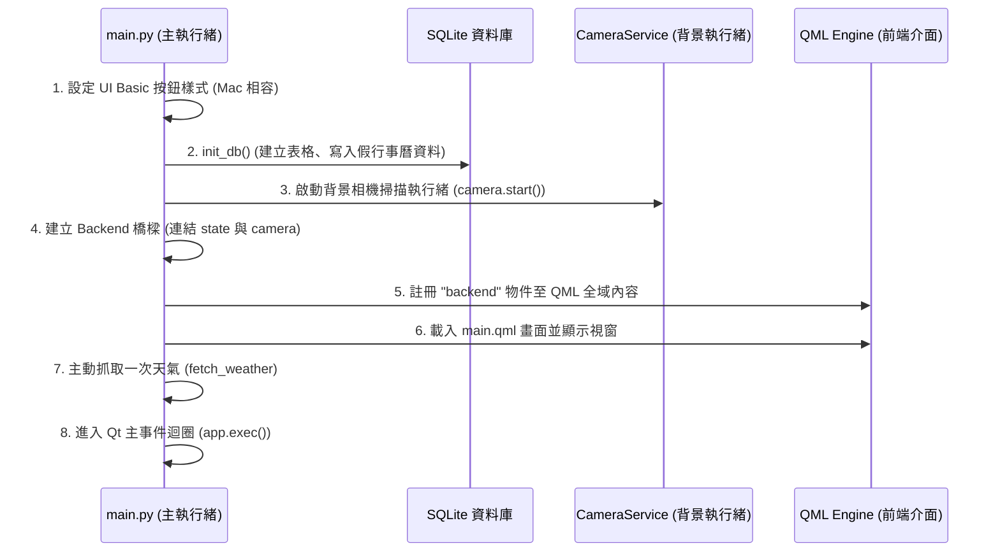
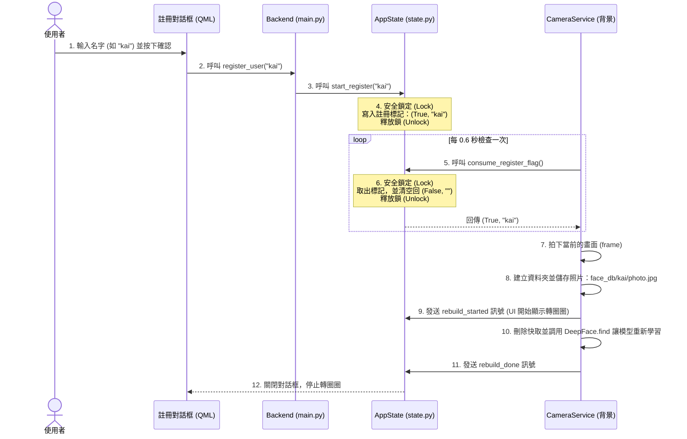
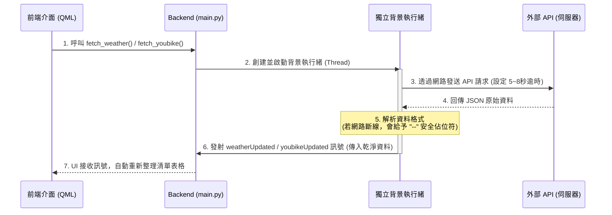

# 玄關智慧中樞 — 系統架構與流程圖手冊

本文件記錄了「玄關智慧中樞」專案中，各個元件（QML 介面、Backend 橋樑、AppState 狀態管理、Camera 背景服務）之間的互動關係、呼叫函式（Functions）與傳遞訊號（Signals）。

---

```
bd/ (專案根目錄)
├── main.py                          # 🚀 程式啟動進入點（連接 Python 後端與 QML 前端）
├── README.md                        # 📝 系統架構與流程圖手冊（內含運作時序與流程圖）
├── entryway.db                      # 🗄️ SQLite 資料庫檔案（儲存行事曆與系統設定）
├── pyproject.toml / uv.lock         # 📦 Python 專案套件依賴與鎖定檔
├── face_db/                         # 👤 註冊的人臉相片資料夾（依人名分類儲存）
│
├── services/                        # ⚙️ 後端服務模組 (Backend Services)
│   ├── state.py                     #     └─ AppState：全域狀態與執行緒同步鎖管理
│   ├── camera_service.py            #     └─ 背景 OpenCV 擷取影像與 DeepFace 人臉辨識
│   ├── database.py                  #     └─ SQLite 資料庫讀寫（行事曆事件與 Visibility 過濾）
│   ├── weather_service.py           #     └─ 非同步抓取 Open-Meteo 天氣 API
│   ├── youbike_service.py           #     └─ 非同步抓取台北市 YouBike 即時車位 API
│   └── settings_service.py          #     └─ 設定管理、OSM 城市搜尋與 YouBike 站點搜尋
│
└── qml/                             # 🎨 前端使用者介面 (Frontend QML)
    ├── main.qml                     #     └─ 主視窗與面板展開/縮放動畫控制器
    ├── LeftPanel.qml                #     └─ 左側常駐面板（時間與天氣）
    ├── RightPanel.qml               #     └─ 右側彈出面板（個人化行事曆與 YouBike）
    ├── ClockWidget.qml              #     └─ 時間/日期小工具
    ├── WeatherWidget.qml            #     └─ 天氣小工具
    ├── CalendarWidget.qml           #     └─ 行事曆清單小工具
    ├── YouBikeWidget.qml            #     └─ YouBike 站點狀態小工具
    ├── SettingsDialog.qml           #     └─ 系統設定彈出視窗
    └── RegisterDialog.qml           #     └─ 人員註冊拍照彈出視窗

```

## 1. 系統啟動與初始化流程 (System Startup)

### 📊 Mermaid 時序圖



## 2. 人臉偵測、辨識與介面更新流程 (Face Detection & UI Update)

### 📊 Mermaid 流程圖


## 3. 新人員註冊流程 (User Registration)

### 📊 Mermaid 時序圖


## 4. 資料非同步抓取流程 (Async Weather & YouBike Fetch)

### 📊 Mermaid 時序圖

